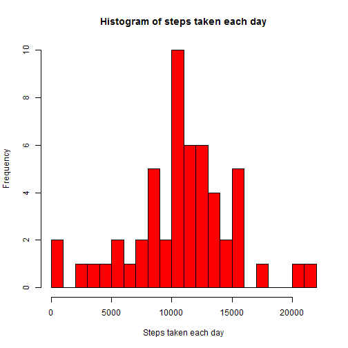
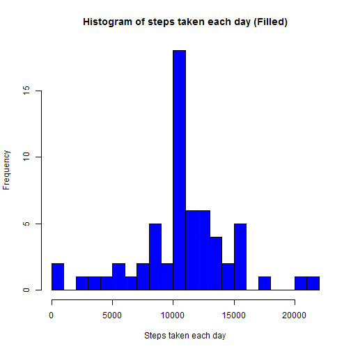
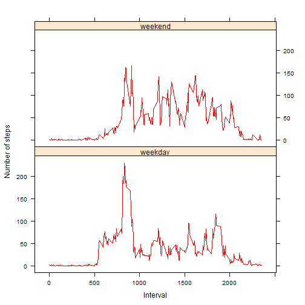

                                                  Activity monitoring
                                ========================================================

Set your current working directory to the directory where the activity.csv file is located.

Reading the csv file


```r
activity=read.csv("activity.csv")
```

Missing values are ignored for this part.

What is the mean total number of steps taken per day?

1.Make a histogram of total number of steps taken each day


```r
steps = tapply(activity$steps, activity$date, sum)
hist(steps, breaks = 30, col = "red", main = "Histogram of steps taken each day", xlab = "Steps taken each day")
```

 

2.Calculate and report the mean and median total number of steps taken per day


```r
meansteps = mean(steps, na.rm = T)
mediansteps = median(steps, na.rm = T)
```
Mean total number of steps per day is 10766.19

Median total number of steps per day is 10765


What is the average daily activity pattern?

1.Make a time series plot (i.e. type = "l") of the 5-minute interval (x-axis) and the average number of steps taken, averaged across all days (y-axis)


```r
stepsavg = tapply(activity$steps, activity$interval, mean, na.rm = T)
plot(stepsavg, type = "l", col = "green", xlab = "5-minute interval", ylab = "Steps averaged", main = "Steps averaged across all days")
```

 

2.Which 5-minute interval, on average across all the days in the dataset, contains the maximum number of steps?


```r
interval = as.numeric(levels(factor(activity$interval)))
activity1 = data.frame(interval, stepsavg)
maxinterval = activity1[activity1[, 2] == max(stepsavg), ]
```

The interval 835 contains the maximum number of steps of 206.1698 on average.

Imputing missing values

1.Calculate and report the total number of missing values in the dataset (i.e. the total number of rows with NAs)


```r
missingval = sum(is.na(activity))
```
There are 2304 missing values in the dataset.

2.Mean for that 5-minute interval is used to fill in all the missing values in the dataset


```r
activityfilled = activity
for (i in 1:nrow(activityfilled)) {
    if (is.na(activityfilled[i, 1])) 
       activityfilled[i, 1] =  activity1[activity1[, 1] == activityfilled[i, 3], ][, 2]
}
```

3.New data set with filled in values


```r
missingnum = sum(is.na(activityfilled))
```

Now, the new data set is same as the original data set but has no missing values.

4.Make a histogram of the total number of steps taken each day and Calculate and report the mean and median total number of steps taken per day. Do these values differ from the estimates from the first part of the assignment? What is the impact of imputing missing data on the estimates of the total daily number of steps?


```r
stepsfilled = tapply(activityfilled$steps, activityfilled$date, sum)
stepsfilled = as.numeric(stepsfilled)
hist(stepsfilled, breaks = 30, col = "blue", main = "Histogram of steps taken each day (Filled)", xlab = "Steps taken each day")
```

 


```r
meanstepsfilled = mean(stepsfilled, na.rm = T)
medianstepsfilled = median(stepsfilled, na.rm = T)
```

After imputing missing values using mean for that 5-minute interval, it shows no difference on the estimates of the total number of daily steps vs the estimates of the first part above.


Are there differences in activity patterns between weekdays and weekends?

1.Create a new factor variable in the dataset with two levels ??? ???weekday??? and ???weekend??? indicating whether a given date is a weekday or weekend day.


```r
activityfilled$weekday = c("weekday")
activityfilled[weekdays(as.Date(activityfilled[, 2])) %in% c("Sunday", "Saturday"), ][4] <- c("weekend") 
activityfilled$weekday = factor(activityfilled$weekday)
```

2.Make a panel plot containing a time series plot (i.e. type = "l") of the 5-minute interval (x-axis) and the average number of steps taken, averaged across all weekday days or weekend days (y-axis). The plot should look something like the following, which was creating using simulated data:  


```r
pplot = split(activityfilled, activityfilled$weekday)
result = lapply(pplot, function(df) tapply(df$steps, df$interval, mean))
activityfinal = data.frame(Interval = rep(interval, 2), stepsfilledavg = as.vector(unlist(result)),
                DAY = factor(rep(c("weekday","weekend"), each = 288)))

library(lattice)
xyplot(stepsfilledavg ~ Interval | DAY, data = activityfinal, col="red",layout = c(1,2), type = "l",
       ylab = "Number of steps")       
```

 


